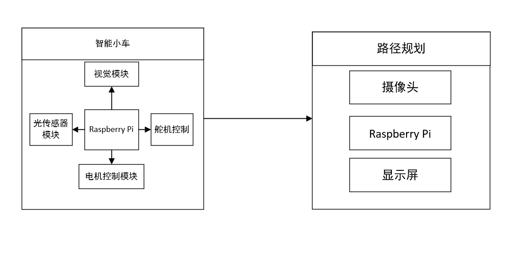

## Raspberry-Car
English / [简体中文](./README_CN.md)

---
The entry for the 2023 Optoelectronics Competition is a high-precision identification "maze treasure hunting" optoelectronic smart car that integrates advanced technologies such as visual processing. It has functions such as automatic driving, autonomous tracking and obstacle avoidance, image reading and image shape recognition. It is divided into two parts: the smart car and the image recognition device. Specifically, the smart car adopts a modular design, including the main control module Raspberry, the motor drive module, the tracking module, the visual module and the power module. The image recognition device consists of a camera, a Raspberry Pi and a display screen, which provides the car with powerful image processing and analysis capabilities.

### Overall Design

### Hardware Support

### Software Design

1. **Path planning**
2. **Target detection**
3. **Vehicle control**

