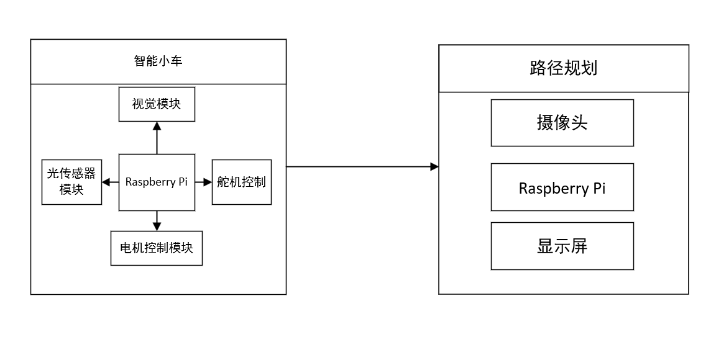

## Raspberry-Car

2023年光电竞赛参赛作品，一款集成视觉处理等先进技术的高精准辨识“迷宫寻宝”光电智能小车，其具备自动行驶、自主寻迹避障、图像读取和图像形状识别等功能，分智能车和识图装置两部分。具体而言，智能车采用模块化设计，包括主控模块Raspberry、电机驱动模块、循迹模块、视觉模块和电源模块。而识图装置由摄像头、Raspberry Pi 和显示屏构成，为小车提供强大的图像处理和分析能力。

### 整体设计

### 硬件支持

### 软件设计

1. **路径规划**
2. **目标检测**
3. **车体控制**

